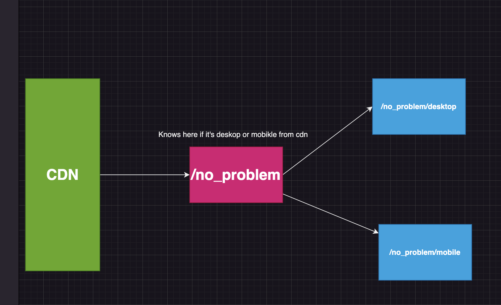

# Tricks for nextjs ssg and screen size

A way to deal with page jumping and loosing scroll on SSG. 
It happens because we use javascript to decide on the layout and we cannot know the user browser on build time.
This way generates both versions and uses cdn and the nextjs middleware to redirect to the correct one.

Lessons learned:
avoid this if possible, describe all the layout states in css.
